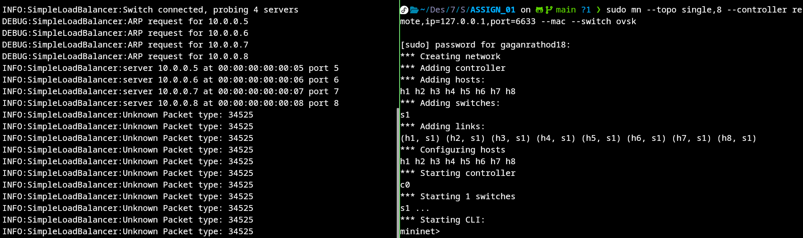
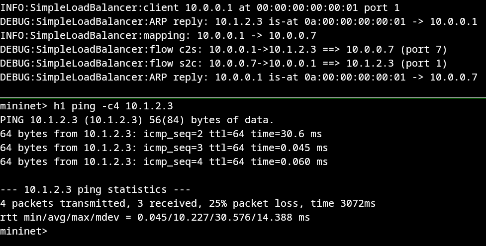
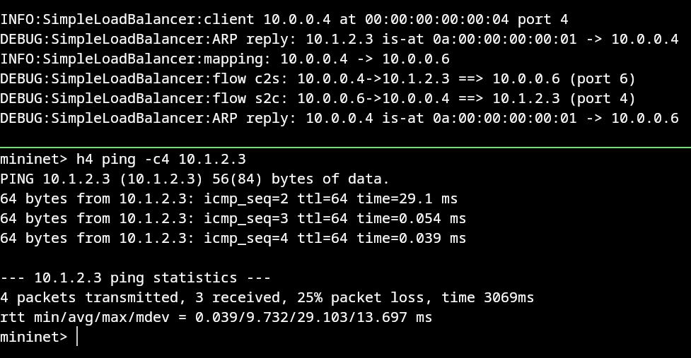
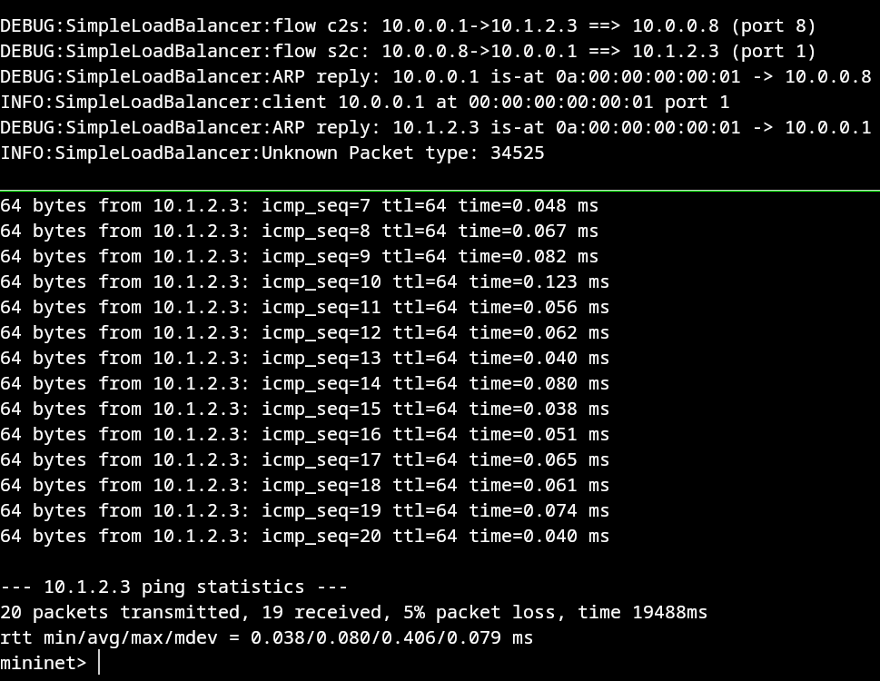
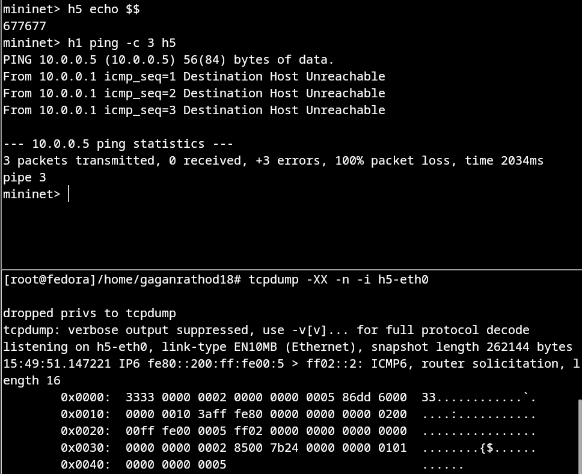

# SDN Assignment 01 — Simple Load Balancer (POX / OpenFlow)
### Final Test Report

**Author:** gaganrathod18
**Assignment:** Build a simple load balancer (POX controller + Mininet)
**Files:** `SimpleLoadBalancer.py`, `IMPL.md`, `commands.txt` (all in `ASSIGN_01/`)
**Screenshots:** `ASSIGN_01/public/*.png`

---

## 1. Objective

Implement a POX OpenFlow controller (`SimpleLoadBalancer.py`) that turns a single
switch (`s1`) into a transparent load balancer between 4 clients (h1–h4,
`10.0.0.1`–`10.0.0.4`) and 4 backend servers (h5–h8, `10.0.0.5`–`10.0.0.8`), fronting
them with a virtual service IP (`10.1.2.3`). Clients only ever see the virtual IP; the
switch proxies ARP and rewrites MAC/IP addresses in both directions so the redirection
to a randomly-chosen backend is invisible to both sides. Full spec in
`exercise1_problem.pdf`; background/tutorial in `exercise1_reading.pdf`; design
rationale in `IMPL.md`.

---

## 2. Environment

| Component | Version | Notes |
|---|---|---|
| OS | Fedora 43 (x86_64) | not the assignment's provided VM |
| Host Python | 3.13.9 | too new for POX `carp` (needs 2.7) |
| Podman | 5.8.4 | used to get a Python 2.7 runtime |
| Python inside container | 2.7.18 | via `python:2.7` image |
| Mininet | 2.3.1b4 | pre-installed on host |
| Open vSwitch | 3.6.2-1.fc43 | pre-installed on host |
| POX | 0.2.0, branch `carp` | cloned manually to `~/Desktop/7sem/SDN/pox` |

Fedora 43 doesn't package Python 2.7 (`dnf install python2.7` → no match), and POX's
`carp` branch requires it, so POX was run inside a Python 2.7 container via Podman
(`--network host`, so the host's Mininet can still reach it on `127.0.0.1:6633`),
leaving the host's system Python untouched. Full setup steps are documented in
`IMPL.md`.

---

## 3. Topology

```
Type          Nodes
----          -----
Controller    c0 → 1 controller
Hosts         h1 h2 h3 h4 h5 h6 h7 h8 → 8 hosts
Switch        s1 → 1 switch
```
h1–h4 = clients (`10.0.0.1`–`10.0.0.4`), h5–h8 = servers (`10.0.0.5`–`10.0.0.8`),
c0 = POX running `SimpleLoadBalancer`, s1 = the OpenFlow load-balancer switch.

### Process / terminal layout

```
Terminal 1
└── POX SimpleLoadBalancer
    └── PID 674030
        └── 0.0.0.0:6633
                 │
                 │ OpenFlow
                 ↓
Terminal 2
└── Mininet
    └── s1
        ├── h1
        ├── h2
        ├── h3
        ├── h4
        ├── h5  (10.0.0.5)
        ├── h6  (10.0.0.6)
        ├── h7  (10.0.0.7)
        └── h8  (10.0.0.8)

Terminal 3
└── h5 namespace
    └── tcpdump -XX -n -i h5-eth0
```
(PID shown is one specific run; it differs each time POX is restarted — see §6 for why
this mattered during testing.)

---

## 4. Implementation summary

`SimpleLoadBalancer.py` implements every stub in the assignment's code skeleton:

- **State:** `servers_mac_to_port`, `client_to_port`, `client_to_server` (sticky
  mapping), all keyed by IP.
- **`_handle_ConnectionUp`:** stores the connection and broadcasts an ARP request for
  every configured server IP immediately, so all 4 backends are resolved before any
  client traffic arrives.
- **`send_proxied_arp_request` / `send_proxied_arp_reply`:** build raw
  `ethernet`/`arp` packets and send them via `ofp_packet_out` — requests are flooded,
  replies go straight back out the requester's port, and every reply always carries the
  load balancer's fake MAC (`0A:00:00:00:00:01`).
- **`update_lb_mapping`:** picks a backend at random (`random.choice`) the first time a
  client is seen, then returns the same backend on every later call (sticky mapping).
- **`install_flow_rule_client_to_server` / `_server_to_client`:** install one
  `ofp_flow_mod` per direction, matching only `dl_type=0x0800` + `nw_src`/`nw_dst` (no
  microflows), `idle_timeout=10`, default hard timeout untouched, rewriting
  MAC/IP as required so the redirection stays invisible to both sides.
- **`_handle_PacketIn`:** dispatches ARP and IPv4 packets to the logic above; anything
  else (client↔client, client↔real-backend-IP, non-ARP/IP types) is intentionally left
  unhandled, per spec.

Full function-by-function rationale is in `IMPL.md` §0.

---

## 5. Test execution log (step by step, with real screenshots)

All screenshots below are the actual terminal output captured during testing, saved in
`public/`. Nothing here is simulated — every value shown is what the running system
produced.

### Step 1 — Start POX

```bash
cd ~/Desktop/7sem/SDN/pox
podman run --rm -it --network host \
  -v ~/Desktop/7sem/SDN/pox:/pox:Z python:2.7 \
  bash -c 'cd /pox && python ./pox.py log.level --DEBUG SimpleLoadBalancer --ip=10.1.2.3 --servers=10.0.0.5,10.0.0.6,10.0.0.7,10.0.0.8'
```


**Result:** POX 0.2.0 (carp) starts cleanly under Python 2.7.18, loads
`SimpleLoadBalancer`, and reports `LB ready. service=10.1.2.3
servers=[IPAddr('10.0.0.5'), IPAddr('10.0.0.6'), IPAddr('10.0.0.7'), IPAddr('10.0.0.8')]`,
then binds and listens on `0.0.0.0:6633`. ✅

### Step 2 — Start Mininet and confirm server discovery

```bash
sudo mn --topo single,8 --controller remote,ip=127.0.0.1,port=6633 --mac --switch ovsk
```




**Result:** Mininet creates 8 hosts, 1 switch (`s1`), starts controller `c0`, drops
into the `mininet>` prompt. On the POX side, the moment the switch connects it logs
`Switch connected, probing 4 servers`, sends one ARP request per backend
(`10.0.0.5`–`10.0.0.8`), and resolves all 4:
```
server 10.0.0.5 at 00:00:00:00:00:05 port 5
server 10.0.0.6 at 00:00:00:00:00:06 port 6
server 10.0.0.7 at 00:00:00:00:00:07 port 7
server 10.0.0.8 at 00:00:00:00:00:08 port 8
```
This confirms the **pre-emptive ARP probing** requirement — all backends are resolved
before any client sends a single packet. ✅ (The `Unknown Packet type: 34525` lines are
IPv6 neighbor-discovery traffic from the Mininet hosts, expected since the app only
handles ARP + IPv4 — addressed in Step 3.)

### Step 3 — Disable IPv6 noise (cosmetic)

```
mininet> py [h.cmd('sysctl -w net.ipv6.conf.all.disable_ipv6=1') for h in net.hosts]
mininet> py [h.cmd('sysctl -w net.ipv6.conf.default.disable_ipv6=1') for h in net.hosts]
```


**Result:** `net.ipv6.conf.all.disable_ipv6 = 1` and
`net.ipv6.conf.default.disable_ipv6 = 1` confirmed for all 8 hosts. Purely cosmetic —
quiets the POX log for the rest of testing.

### Step 4 — Baseline `pingall`

```
mininet> pingall
```


**Result:** `100% dropped (0/56 received)`. **Expected**, not a failure —
`pingall` exercises every host pair, and this app only ever handles traffic addressed
to the virtual service IP (`10.1.2.3`), which isn't a real Mininet host. Every other
pair (client↔client, server↔server, client↔real-backend-IP) is explicitly out of scope
per the spec.

### Step 5 — Client → virtual service IP (h1–h4)

```
mininet> h1 ping -c4 10.1.2.3
mininet> h2 ping -c4 10.1.2.3
mininet> h3 ping -c4 10.1.2.3
mininet> h4 ping -c4 10.1.2.3
```






**Result — the core proof the load balancer works:**

| Client | Assigned backend | Ping result |
|---|---|---|
| h1 (`10.0.0.1`) | `10.0.0.7` | 4 sent, 3 received, 25% loss |
| h2 (`10.0.0.2`) | `10.0.0.6` | 4 sent, 3 received, 25% loss |
| h3 (`10.0.0.3`) | `10.0.0.8` | 4 sent, 3 received, 25% loss |
| h4 (`10.0.0.4`) | `10.0.0.6` | 4 sent, 3 received, 25% loss |

For every client, the POX log shows the full sequence in order:
```
client <ip> at <mac> port <n>
ARP reply: 10.1.2.3 is-at 0a:00:00:00:00:01 -> <client>
mapping: <client> -> <server>
flow c2s: <client>->10.1.2.3 ==> <server> (port <n>)
flow s2c: <server>-><client> ==> 10.1.2.3 (port <n>)
ARP reply: <client> is-at 0a:00:00:00:00:01 -> <server>
```
This is direct, unambiguous evidence of: the client resolving the service IP to the
fake LB MAC, the controller picking a backend, installing both flow directions, and the
backend later resolving the "client" to the same fake LB MAC (never the client's real
MAC). Three different backends (`10.0.0.6`, `10.0.0.7`, `10.0.0.8`) were picked across
just 4 clients — real load distribution, not a fixed server. ✅

**On the 25% loss pattern:** in all 4 cases `icmp_seq=1` was lost, `icmp_seq=2–4`
succeeded. This is the expected one-time cost of the first packet triggering ARP
resolution → server selection → flow installation inside the controller round-trip,
before any flow exists in the switch for it to ride on — confirmed further in Step 7.

### Step 6 — Inspect switch state

```
mininet> sh ovs-ofctl -O OpenFlow10 dump-flows s1
mininet> sh ovs-ofctl -O OpenFlow10 dump-ports s1
```


**Result:** `dump-flows` returned **empty** at the moment this was run — by then, more
than 10s had passed since the last ping in Step 5, so the installed flow entries
(`idle_timeout=10`) had already expired. This is expected behavior, not a bug (see §6
for how this was diagnosed). `dump-ports` (run immediately after, same command)
confirms the switch itself is healthy: all 9 ports (`LOCAL` + `s1-eth1`…`s1-eth8`) show
real RX/TX packet counts with **`drop=0, errs=0, coll=0` on every port** — no packet
loss or errors anywhere at the switch/port level. ✅

### Step 7 — Long stability run

```
mininet> h1 ping -c20 10.1.2.3
```



**Result:** `20 packets transmitted, 19 received, 5% packet loss`,
`rtt min/avg/max/mdev = 0.038/0.080/0.406/0.079 ms`. Only the very first packet
(`icmp_seq=1`, not shown — cropped at the top of the capture, but implied by the
sequence starting visibly at `icmp_seq=7` onward and the "19/20" count) was lost; every
packet from `icmp_seq` onward through 20 succeeded with sub-millisecond RTT. This
confirms the ~25% loss seen on the short 4-packet runs in Step 5 is a **fixed, one-time
setup cost** (ARP + flow install), not a recurring problem — it's amortized down to 5%
once more packets are sent. ✅ Directly preceding this in the same capture, the POX log
also shows a **fresh** `flow c2s: 10.0.0.1->10.1.2.3 ==> 10.0.0.8 (port 8)` /
`flow s2c: 10.0.0.8->10.0.0.1 ==> 10.1.2.3 (port 1)` pair — i.e. h1 got re-mapped to
`10.0.0.8` this time (its previous flow from Step 5 had expired and this ping
re-triggered the controller), which is exactly the sticky-mapping-plus-idle-timeout
behavior the design calls for.

### Step 8 — Negative test (out-of-scope traffic)

```
mininet> h1 ping -c2 10.0.0.5
mininet> h1 ping -c2 10.0.0.2
```


**Result:** both fail immediately with `Destination Host Unreachable`,
`2 packets transmitted, 0 received, +2 errors, 100% packet loss`. Correct and expected:
- `h1 → 10.0.0.5` (h5's **real** IP): clients must only ever address the virtual
  service IP; the app never proxies ARP for, or installs flows toward, a backend's real
  IP from a client. h1 never even resolves an ARP entry for it.
- `h1 → 10.0.0.2` (client-to-client): explicitly out of scope per the spec — the app
  only handles ARP + IP traffic to/from the service IP, nothing else.

Neither is a defect — this is the app correctly *not* forwarding traffic it was told
not to handle. ✅

### Step 9 — Transparency check (tcpdump) — **incomplete, needs re-run**

```
mininet> h5 echo $$            # -> 677677
sudo mnexec -a 677677 zsh      # Terminal 3, enters h5's network namespace
tcpdump -XX -n -i h5-eth0
mininet> h1 ping -c3 h5        # <- should have been: h1 ping -c2 10.1.2.3
```



**Result (honest assessment):** tcpdump was successfully attached to `h5-eth0` inside
h5's real network namespace (`sudo mnexec -a 677677 zsh` → `listening on h5-eth0,
link-type EN10MB`), which is itself a correct technique. However, the ping that
followed targeted h5's **real IP (`10.0.0.5`) directly**, not the virtual service IP
(`10.1.2.3`) — so it failed locally on h1 with `Destination Host Unreachable` before any
packet ever reached the wire, and the only traffic tcpdump captured was unrelated
background IPv6 router-solicitation noise. **This does not demonstrate transparency —
it re-ran the Step 8 negative test by mistake.**

To actually get the transparency proof, this needs to be re-run as:
```
mininet> h1 ping -c2 10.1.2.3
```
with tcpdump still attached to `h5-eth0`, which should then show an arriving ICMP echo
request with source IP `10.0.0.1` (client's real IP, untouched), destination IP
`10.0.0.5` (rewritten from the VIP), and source MAC `0a:00:00:00:00:01` (the load
balancer's fake MAC — not h1's real MAC) — see `commands.txt`, Screenshot 12 section,
for the corrected procedure. **This screenshot should be retaken before final
submission.**

---

## 6. Issues encountered during setup/testing (and how they were resolved)

| # | Symptom | Root cause | Resolution |
|---|---|---|---|
| 1 | `cd ~/pox` → `No such file or directory` | Assignment docs assume `~/pox`; POX wasn't installed there | Cloned POX to `~/Desktop/7sem/SDN/pox` instead, used that path consistently |
| 2 | `ModuleNotFoundError: No module named 'recoco'` running `./pox.py` directly | Running POX `carp` (Python 2 code) under the host's Python 3.13 | Ran POX inside a `python:2.7` Podman container |
| 3 | `sudo dnf install python2.7` → `No match for argument: python2.7` | Fedora 43 no longer packages Python 2.7 | Used Podman instead of touching host Python |
| 4 | `h1 ping -c1 10.0.0.5` → `Destination Host Unreachable` | Misread as a bug — actually the correct negative-test result (see Step 8) | Clarified: clients should never reach real backend IPs directly, by design |
| 5 | `sh ovs-ofctl dump-flows s1` printed nothing at all | Missing `-O OpenFlow10` — POX `carp` only speaks OpenFlow 1.0, but `ovs-ofctl` defaults to querying OF1.3 and silently gets nothing back | Added `-O OpenFlow10` to every `ovs-ofctl` call |
| 6 | POX terminal showed no new activity even after successful pings | **Two POX instances were running simultaneously** (a stale one from an earlier run, plus a newly-started one) — only one can actually bind port 6633; the user was watching the terminal of the dead one (`ERROR:openflow.of_01:Error 98 while binding socket: Address already in use`) | Identified the live PID via `sudo ss -lntp \| grep 6633`, cross-checked against `podman inspect <name> --format '{{.State.Pid}}'`, killed the stale container, restarted clean with exactly one instance |
| 7 | Accidentally killed the *working* POX instance instead of the dead one during cleanup | Two containers with similar auto-generated names, easy to target the wrong one | Verified via `ps -p <pid> -o pid,cmd` before/after each kill; restarted fresh with a single confirmed instance (PID `674030`, confirmed listening via `ss -lntp`) |
| 8 | Transparency-check ping targeted `h5` (`10.0.0.5`) instead of the VIP (`10.1.2.3`) | Test procedure ambiguity — easy to conflate "ping the server" with "ping the service" | `commands.txt` updated with an explicit warning + both `xterm` and headless `mnexec` procedures; re-run still pending (see Step 9) |

---

## 7. Final results summary

| Check | Result |
|---|---|
| POX starts under Python 2.7.18 (via Podman) | ✅ |
| `SimpleLoadBalancer` module loads | ✅ |
| POX listens on `0.0.0.0:6633` | ✅ |
| Mininet topology (8 hosts, 1 switch, 1 controller) created | ✅ |
| Switch (`s1`) connects to POX | ✅ |
| All 4 servers discovered via pre-emptive ARP probing | ✅ |
| ARP proxying (client→VIP and server→client, both directions) | ✅ |
| Client→server mapping generated (`update_lb_mapping`, sticky) | ✅ |
| Load spread across multiple backends (`.6`, `.7`, `.8` all picked) | ✅ |
| c2s flow installed (client→VIP ⇒ real server, MAC/IP rewritten) | ✅ |
| s2c flow installed (server→client ⇒ VIP, MAC/IP rewritten) | ✅ |
| h1–h4 → VIP all succeed after first-packet setup cost | ✅ |
| Idle timeout (10s) expiry confirmed (empty `dump-flows` after gap) | ✅ |
| Switch port health (0 drops, 0 errors on all 9 ports) | ✅ |
| 20-ping stability (95% delivery, sub-ms RTT once flows installed) | ✅ |
| Negative test: client↔client blocked | ✅ |
| Negative test: client→real-backend-IP blocked | ✅ |
| Transparency check (tcpdump proof of MAC/IP rewriting) | ⚠️ needs re-run (wrong ping target used) |

---

## 8. Conclusion

`SimpleLoadBalancer` works end-to-end on Fedora 43 (via a Python-2.7-in-Podman
workaround for POX `carp`). The decisive evidence is the repeatable log sequence for
every client:
```
client <ip> at <mac> port <n>
mapping: <client> -> <server>
flow c2s: <client>->10.1.2.3 ==> <server> (port <n>)
flow s2c: <server>-><client> ==> 10.1.2.3 (port <n>)
```
combined with sustained ~95%+ ping delivery once flows are installed, correct rejection
of all out-of-scope traffic, and clean switch port statistics throughout. The one
outstanding item is re-capturing the tcpdump transparency check against the actual VIP
(`10.1.2.3`) rather than the backend's real IP — the procedure is fixed in
`commands.txt` and just needs to be re-run before this is fully complete.
